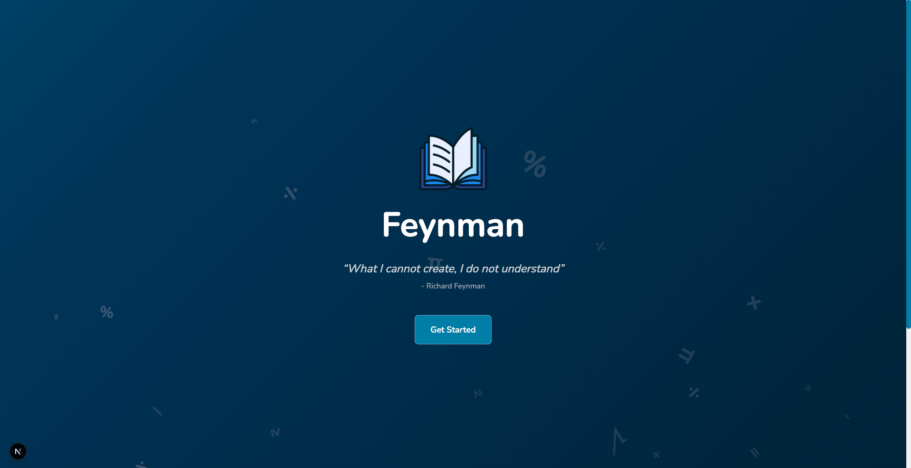
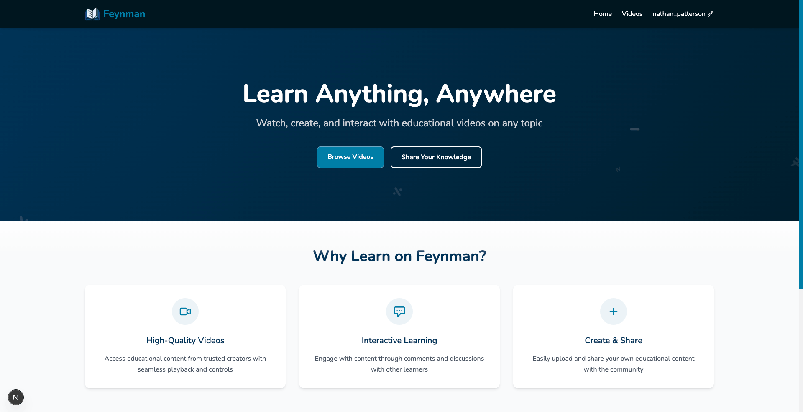
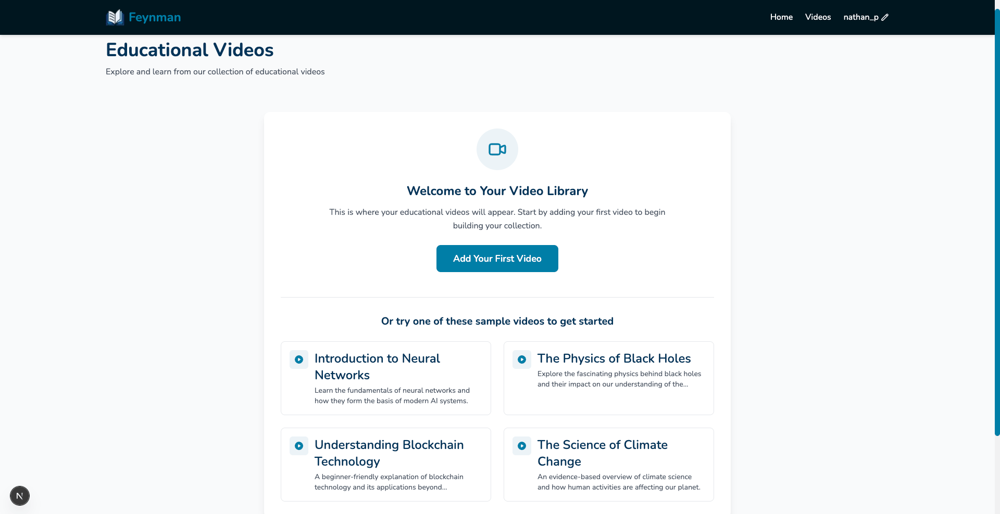
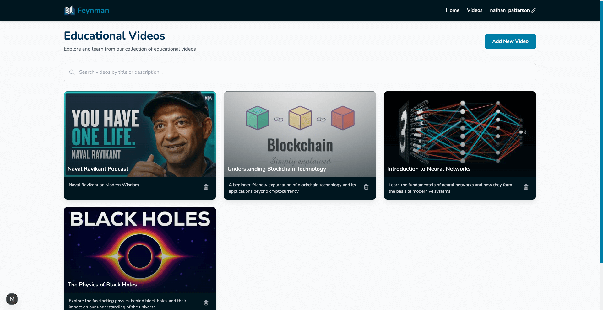
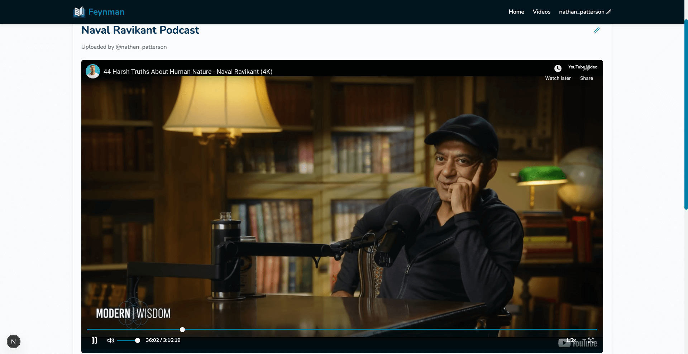

# Feynman

An educational platform that provides video content management.

   
   
   
   
   

## Setup Instructions

### Prerequisites

- Node.js (v16.x or higher)
- npm (v8.x or higher)

### Installation

1. Clone the repository

```
git clone https://github.com/yourusername/edtech-platform.git
cd edtech-platform
```

2. Install dependencies

```
npm install
```

3. Start the development server

```
npm run dev
```

4. Open your browser and navigate to http://localhost:3000
   (or other specified URL in console)

## Technologies Used

- Next.js
- React
- TypeScript
- Tailwind CSS

## Future Dev Considerations
- More extensive compenentization/modularization (refactorting code)
- Implement memoization through hooks for  render optimization 
- Optimize load  times w/ lazy & suspense
- Enhance accessibility: ARIA attributes, keyboard navigation, skip nav
- Add Error Boundaries
- Testing for custom hook
- Theming support
